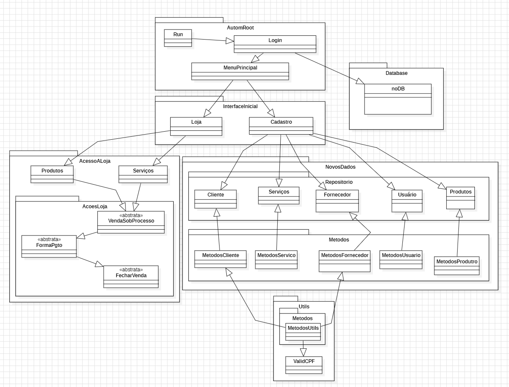

# autom-java-console

> Projeto todo em java.console para reforçar os conhecimentos em POO.
>
> *A documentação é escrita em paralelo com a evolução do projeto. Até o momento, a visão do fluxo do sistema é essa abaixo (PENDENTE ALTERAÇÕES NO DIAGRAMA)*

## 🚀 Áreas implementadas
Tela Cadastro:
- Cliente
- Fornecedor
- Usuário
- Produtos e Serviços

## 🔜 Ajustes e melhorias

O projeto ainda está em desenvolvimento e as próximas atualizações serão voltadas nas seguintes tarefas (novas tarefas serão informadas aqui):

✅ *Validação de exclusão de item da lista de cada classe "Metodos" `-> exemplo: código X já foi excluído`*

✅ *Incluir condição para impressão da mensagem de saída `-> sout("Alteração concluida") ou sout("a tabela está vazia")`*

✅ *Aplicar validação nos métodos de localização*

✅ *Incluir novo método para validar se o atributo getAtividades da tela de fornecedores está vazia, para assim, permitir o insert*

✅ *Revisar ajustes feitos na area de fornecedor para as areas Cliente e Usuário `-> validId`*

✅ *Implementar equals e hashcode para CPF e CNPJ*

✅ *Aplicar try/catch em métodos que utilizam "throws Exception"*

✅ *Validar se os logs implementados estão funcionando da forma que foi planejada*

✅ *Descrição dos métodos `-> o que são, o que fazem e o que retornam`*

✅ *Releitura de nomes de variáveis, métodos e classes `-> exemplo: Map<Integer, Servicos> x = new HashMap<>(); -> Map<Integer, Servicos> mapServ = new HashMap<>();`*

✅ *(se possível) aplicar cor fixa nos menus (Cor fixa nos títulos)*

✅ *Limpar comentários das classes `-> DEFINIR ELES COMO RASCUNHO`*

✅ *Verificar a possibilidade de criar uma validação de response code na parte do cep*

✅ *Inserir fornecedores na lista de produtos*

✅ *Associar as atividades aos fornecedores*

✅ *Criar método para remover e incrementar atividades*

✅ *Necessário mudar a forma de coleta de CEP `-> atual: via XML, atualizar para: via JSON`*

## 📝 Áreas pendentes

Tela Cadastro:
- Funcionário
- Carro

Tela Loja:
- A definir áreas

## 📫 Contribuindo para autom-java-console

Para contribuir com <nome_do_projetoautom-java-console, siga estas etapas:

1. Faça um fork deste repositório.
2. Crie um branch: `git checkout -b <nome_branch>`.
3. Faça suas alterações e confirme-as: `git commit -m '<mensagem_commit>'`
4. Envie para o branch original: `git push origin <nome_do_projeto> / <local>`
5. Crie a solicitação de pull.