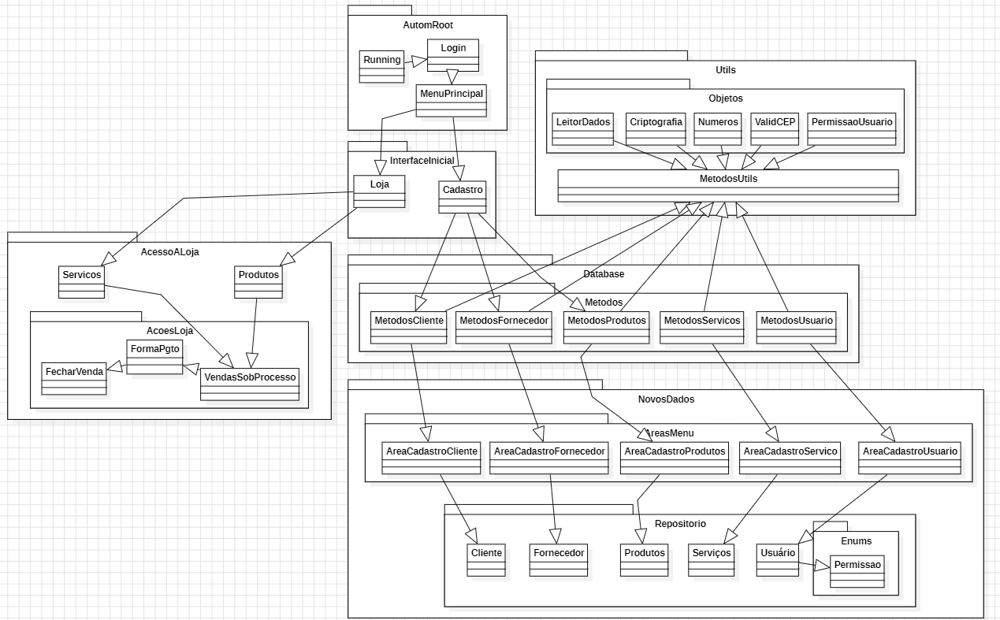

# autom-java-console

> Projeto todo em java.console para reforçar os conhecimentos em POO.
>
> *A documentação é escrita em paralelo com a evolução do projeto. Até o momento, a visão do fluxo do sistema é essa abaixo (PENDENTE ALTERAÇÕES NO DIAGRAMA)*

## 🚀 Áreas implementadas
**Tela Cadastro:**
- Clientes
- Fornecedores
- Usuários
- Produtos
- Serviços
- Funcionários
- Carros

## 🔜 Ajustes e melhorias

O projeto ainda está em desenvolvimento e as próximas atualizações serão voltadas nas seguintes tarefas (novas tarefas serão informadas aqui):

✔️ **Parte 1 concluída**

✔️ **Parte 2 concluída**

**_mais detalhes no arquivo de ajustes [ToDo](ToDo.txt)_**

🔄 *Parte 3 abaixo*:

✅ Desenvolver tela de cadastro

⬜ Desenvolver da tela de loja

## 📝 Áreas pendentes

**Tela Loja:**
- A definir áreas

## 📫 Contribuindo para *autom-java-console*

Para contribuir com *autom-java-console*, siga estas etapas:

1. Faça um fork deste repositório.
2. Crie um branch: `git checkout -b <nome_branch>`.
3. Faça suas alterações e confirme-as: `git commit -m '<mensagem_commit>'`
4. Envie para o branch original: `git push origin <nome_do_projeto> / <local>`
5. Crie a solicitação de pull.